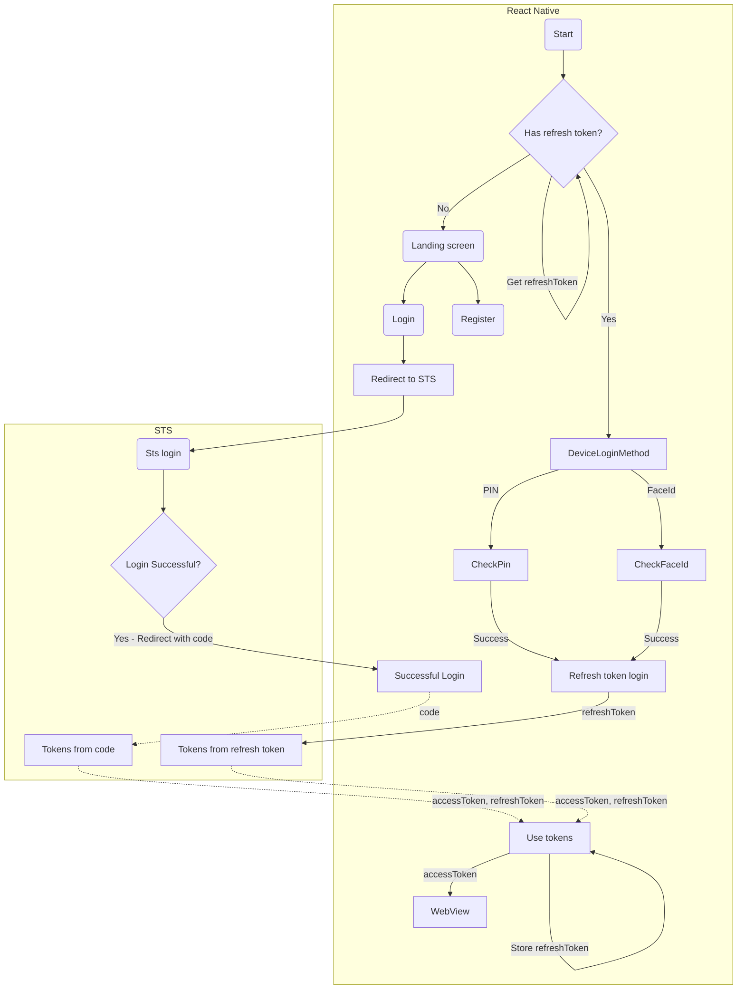

# Meniga Mobile Test
This repository is a proof of concept on how to package Meniga ReactJS frontend as React Native app. 

Links:
* https://medium.com/swlh/how-to-build-a-react-native-app-with-react-website-and-webview-2ae53594dc07
* https://docs.expo.dev/guides/authentication/#identityserver-4
* https://github.com/daoodaba975/exlogrn/
* https://dev.to/allanloji/setting-up-biometric-login-on-your-react-native-app-4903
* https://www.alto.com/blog/post/part-1-implementing-biometric-login
* https://blog.logrocket.com/implementing-react-native-biometric-authentication-expo/
* https://docs.expo.dev/versions/latest/sdk/local-authentication/
* https://github.com/expo/expo/issues/21694
* https://docs.expo.dev/develop/development-builds/create-a-build/
* https://docs.expo.dev/versions/latest/sdk/auth-session/#authsessionexchangecodeasyncconfig-discovery
* https://github.com/FusionAuth/fusionauth-quickstart-react-native/
